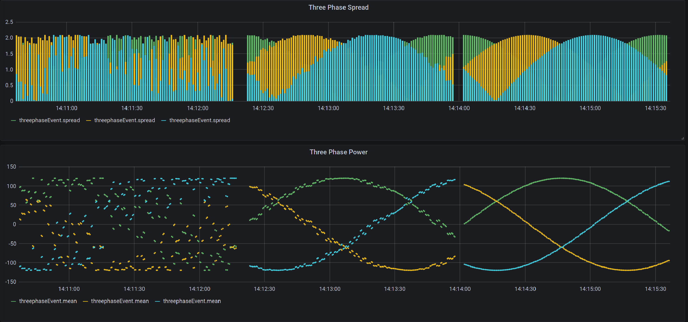
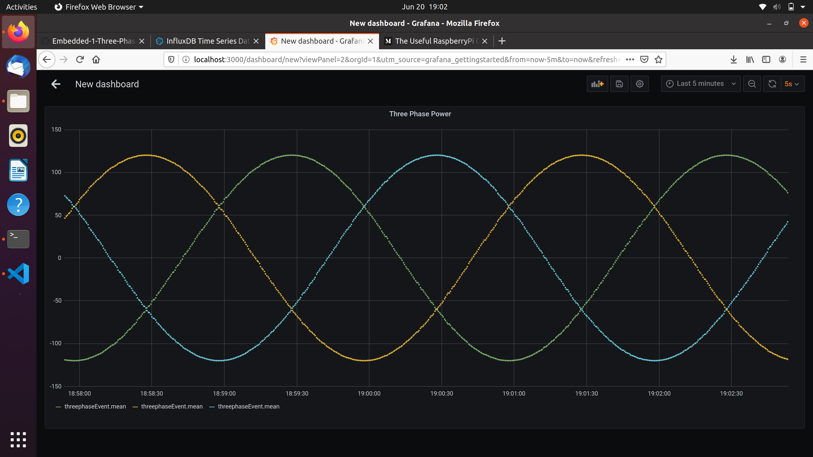

# Embedded Linux Project 1
## Three phase power synthetic data generation, broadcasting, and visualization

**Purpose:** Three phase power makes modern life possible;...

**Objective:**
- Two C applications - generator and forwarder
- Generator application to generate a three-phase sinusoid akin to power systems; the values will be sent as connectionless UDP packets to a local port. Generator should be able to supply noisy data on command.
- Forwarder application to listen on local port and forward packets to a machine on the LAN subnet
- Method of visualization and processing - using a seperate machine on the network, pick up the packets. In this example we utilize InfluxDB and Grafana to respectively store and display/process data 

**Results:**  



---
## Embedded Development
A major challenge in developing on embedded platform is development and deployment. Difficulties include verifying correct compiler, setting up the hardware, and wrangling with networking issues - all before development can take place. To circumvent the issue, QEMU (Quick EMUlator) can be used to emulate the hardware; along with a cross-compiler on the development machine, the developer can comfortably architect, develop, and deploy software without logistical hubub.

### QEMU Setup for Raspberry Pi on Ubuntu host machine
Qemu Installation
```bash
# Update list of available software
sudo apt update

# Install qemu and additional utilities
sudo apt install qemu 
```

We'll also need the respective kernel, device tree blob, and image to run the emulator - in this example we the latest available *Buster*:
- https://github.com/dhruvvyas90/qemu-rpi-kernel/raw/master/kernel-qemu-4.19.50-buster
- https://github.com/dhruvvyas90/qemu-rpi-kernel/raw/master/versatile-pb-buster.dtb
- https://downloads.raspberrypi.org/raspios_lite_armhf_latest

Let's firstly convert the image format into a *qcow* - a format more digestible by QEMU rather than the raw *.img
```bash
qemu-img convert -f raw -O qcow2 2020-05-27-raspios-buster-lite-armhf.img 2020-05-27-raspios-buster-lite-armhf.qcow
```

At this point we can run the QEMU emulator, but we need to make some host machine changes to bridge the host network...

```bash
ROOTFS=~/Development/image/2020-05-27-raspios-buster-lite-armhf.qcow
KERNEL=~/Development/qemu-rpi-kernel/kernel-qemu-4.19.50-buster
DTB=~/Development/qemu-rpi-kernel/versatile-pb-buster.dtb

# Executes emulator for ARM architecture specified for RPi
sudo qemu-system-arm -kernel ${KERNEL} -append "root=/dev/sda2 panic=1 rootfstype=ext4 rw" -hda ${ROOTFS} -dtb ${DTB} -cpu arm1176 -m 256 -M versatilepb -no-reboot -nographic -serial stdio -monitor none -net nic -net user -net tap,ifname=tap0,script=no,downscript=no
```

### Cross-compiling for Raspberry Pi
We're going to need the Raspberry Pi toolchain
```bash
git clone https://github.com/raspberrypi/tools.git
```
The compiler we will be using is located in *arm-bcm2708/arm-rpi-4.9.3-linux-gnueabihf/bin/arm-linux-gnueabihf-gcc*. To fully utilize the cross-compiling capability, we can integrate CMake into compilation - but this overview will not utilize it.

--- 

## Host Setup

This tutorial utilizes two tools to store data and subsequently display the data. **InfluxDB** is a robust time-series database, which happens to be edge-friendly for actually deploying on the embedded systems themselves! **Grafana** is an open source web application that can be run locally for telemetry visualization

---
## Execution

**[Edge]** Start the three phase generator - you can open a seperate teminal session or daemonize the process
```bash
./generator 1 # Frequency noise 0-1 Hz
./generator 10 # Frequency noise 0-10 Hz
./generator 100 # Frequency noise 0-100 Hz
```

**[Edge]** Start the forwarder application - modify host IP destination in source code and recompile before executing
```bash
./forwarder
```

**[Host]** After linking the local Grafana instance and InfluxDB - the Python UDP receiver code will populate the database which can be viewed in "real-time".
```bash
python udp-recv.py
```

Navigating to the default *localhost:3000* on the host machine will allow the user to configure all three phases for plotting; additional mathmatical formulas are available for on-the-fly visualizations.  

